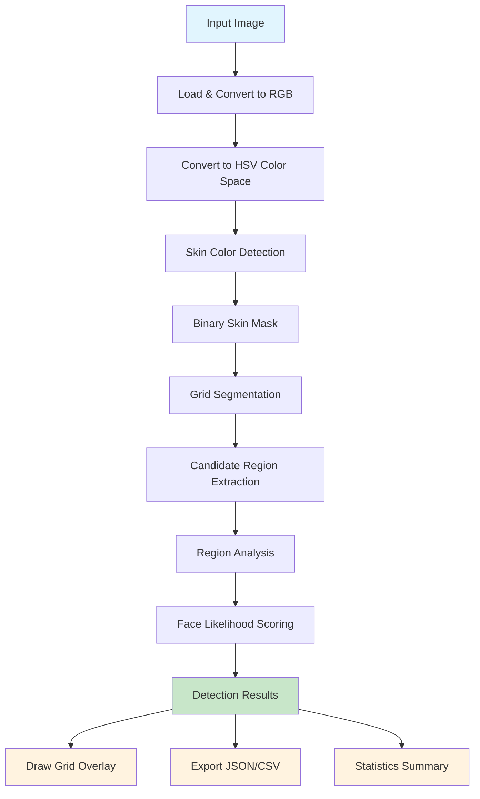

# FaceGrid

[](https://github.com/officethree/FaceGrid/actions/workflows/ci.yml)
[](https://www.python.org/downloads/)
[](LICENSE)
[](https://github.com/psf/black)

**Face detection grid analyzer** — a Python library for detecting face-like regions in images using skin color detection and feature analysis. No ML models required.

FaceGrid divides images into a grid, identifies skin-tone regions using HSV color space analysis, groups candidate regions, and scores them for face likelihood based on geometric and color distribution heuristics.

## Architecture



## Installation

```bash
pip install -e .
```

## Quickstart

```python
from facegrid import FaceGrid

fg = FaceGrid()

# Load an image
image = fg.load_image("photo.jpg")

# Detect face-like regions
detections = fg.detect_faces(image)

# Get statistics
stats = fg.get_stats(detections)
print(f"Found {stats['total_detections']} candidate regions")

# Draw detection grid overlay
result_image = fg.draw_grid(image, detections)
result_image.save("output.jpg")

# Export results
fg.export(detections, format="json", path="results.json")
```

## Configuration

FaceGrid is configurable via environment variables or the `FaceGridConfig` class:

```python
from facegrid.config import FaceGridConfig

config = FaceGridConfig(
    grid_size=16,
    min_skin_ratio=0.3,
    score_threshold=0.5,
    hsv_lower=(0, 30, 60),
    hsv_upper=(25, 180, 255),
)
fg = FaceGrid(config=config)
```

See `.env.example` for all available settings.

## Development

```bash
make install      # Install dependencies
make test         # Run tests
make lint         # Run linter
make format       # Format code
```

## Contributing

See [CONTRIBUTING.md](CONTRIBUTING.md) for guidelines.

---

Inspired by computer vision and face detection trends.

Built by Officethree Technologies | Made with love and AI
